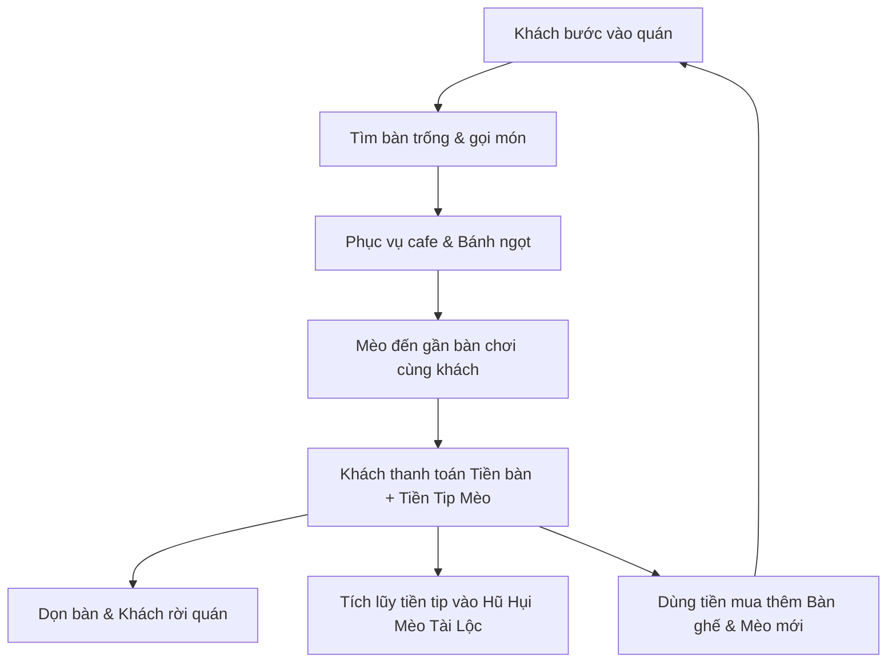

# BÁO CÁO PHÂN TÍCH CHUYÊN SÂU DỰ ÁN GAME: CAT CAFE SIMULATOR

---

## 1. TỔNG QUAN DỰ ÁN (EXECUTIVE SUMMARY)

- **Tên dự án:** Cat Cafe Simulator (Mô Phỏng Quán Cafe Mèo)
- **Thể loại:** Casual Tycoon / Time Management / Idle Simulator / Pet Care
- **Engine:** Unity Engine (URP - Universal Render Pipeline)
- **Nền tảng mục tiêu:** Đa nền tảng (Cross-Platform: Windows PC, macOS, Android, iOS)
- **Đối tượng người chơi:** Người yêu thú cưng, người thích game giải trí nhẹ nhàng (Cozy / Wholesome Games), người chơi idle tycoon.

---

## 2. KIẾN TRÚC MÃ NGUỒN & THIẾT KẾ PHẦN MỀM (TECHNICAL ARCHITECTURE)

### 2.1. Các Mẫu Thiết Kế Chủ Đạo (Design Patterns)
1. **Singleton Pattern kết hợp `DontDestroyOnLoad`:**
   - Các Manager cốt lõi (`GameManager`, `MoneyManager`, `SaveManager`, `FirebaseManager`, `SoundManager`, `ObjectPoolManager`, `PerformanceManager`) được duy trì xuyên suốt giữa các Scene (`MainMenu` <-> `CafeScene`).
   - Giúp việc truyền trạng thái kinh tế, cấu hình âm thanh và kết nối mạng không bị gián đoạn.

2. **Data-Driven Architecture (Kiến trúc hướng dữ liệu):**
   - Sử dụng `ScriptableObject` (`CatData`, `LevelData`) để cấu hình chỉ số mèo (tốc độ, giá mua, độ quý hiếm, prefabs) và thông số màn chơi (thời gian ca, mục tiêu doanh thu, mốc giờ cao điểm).
   - Thiết kế này cho phép Game Designer dễ dàng thêm màn chơi hoặc giống mèo mới mà không cần can thiệp vào logic code.

3. **Event-Driven UI (Lập trình hướng sự kiện):**
   - Toàn bộ hệ thống UI (`UIManager`, `CatAlbumUI`, `LeaderboardUI`) hoạt động theo cơ chế Publish-Subscribe (Lắng nghe sự kiện `Action`).
   - Khi tiền tệ, kim cương, số mèo, hay cấp độ thay đổi, UI chỉ vẽ lại khi có thông báo, loại bỏ hoàn toàn việc gọi cập nhật trong `Update()`.

4. **Object Pooling (Bộ đệm đối tượng tái sử dụng):**
   - Áp dụng triệt để cho Khách hàng (`CustomerAI`), Chữ nổi hiển thị tiền/chỉ số (`FloatingText`), và Hiệu ứng hạt (`CatVFXManager`).
   - Ngăn chặn việc tạo mới và hủy đối tượng liên tục (`Instantiate`/`Destroy`), triệt tiêu giật lag (GC Spikes).

---

## 3. PHÂN TÍCH HỆ THỐNG GAMEPLAY & VÒNG LẶP KINH TẾ (GAMEPLAY LOOP)

### 3.1. Vòng Lặp Cốt Lõi (Core Gameplay Loop)


### 3.2. Cơ Chế Giữ Chân Người Chơi (Retention & Monetization Hooks)
1. **Hũ Hụi Mèo Tài Lộc (Lucky Piggy Bank):**
   - Mỗi lần khách tip cho mèo, một phần tiền tip được tích lũy vào hũ.
   - Khi hũ đầy, người chơi có thể đập hũ để nhận một khoản tiền lớn hoặc thưởng thêm kim cương, tạo cảm giác thỏa mãn (Dopamine hit).
2. **Thu Nhập Vắng Nhà (Offline Idle Earnings):**
   - Khi người chơi tắt game, hệ thống ghi nhận dấu thời gian (`lastSaveTimestamp`).
   - Khi quay lại, người chơi nhận được thu nhập nhàn rỗi (tối đa 8 tiếng), kích thích thói quen quay lại quán mỗi ngày.
3. **Giờ Cao Điểm (Rush Hour):**
   - Xuất hiện ngẫu nhiên hoặc theo mốc thời gian trong ca làm việc, tần suất khách vào quán tăng gấp đôi, tạo nhịp chơi kịch tính.
4. **Điểm Danh 7 Ngày (Daily Rewards):**
   - Phần thưởng tăng dần từ Tiền khởi nghiệp -> Kim Cương Mèo -> Thức ăn hoàng gia -> Jackpot Ngày 7.
5. **Bộ Sưu Tập Mèo (Cat Album):**
   - Danh mục hiển thị các giống mèo đã sở hữu và chưa sở hữu, kích thích tâm lý hoàn thành bộ sưu tập của người chơi.

---

## 4. HẠ TẦNG ĐÁM MÂY FIREBASE & BẢO MẬT (FIREBASE CLOUD ARCHITECTURE)

### 4.1. Cơ Chế Hoạt Động Của Firebase Trong Game
1. **Firebase Authentication (Ẩn danh - Anonymous Auth):**
   - Người chơi không cần nhập mật khẩu hay đăng ký phức tạp. Ngay khi mở game, hệ thống tự động cấp một `UID` duy nhất từ Firebase Auth và lưu cục bộ.
   - Cho phép người chơi đổi sang máy mới hoặc liên kết tài khoản sau này mà không bị mất dữ liệu.
2. **Đồng Bộ Dữ Liệu 2 Chiều & Phân Giải Xung Đột (Conflict Resolution):**
   - **Local-First Architecture:** Game luôn nạp dữ liệu từ máy trước để vào game tức thì (0ms latency).
   - Sau đó kiểm tra dữ liệu đám mây:
     - Nếu `cloudData.lastSaveTimestamp > localData.lastSaveTimestamp`: Thiết bị mới hoặc vừa tải lại game -> Cập nhật từ Cloud về máy.
     - Nếu `localData.lastSaveTimestamp > cloudData.lastSaveTimestamp`: Người chơi vừa chơi Offline và có tiến trình mới -> Tự động đẩy bản lưu mới lên Cloud.
3. **Bảng Xếp Hạng Toàn Cầu (Global Leaderboard):**
   - Lưu trữ tại `/leaderboard/{userId}` bao gồm: Tên người chơi, Cấp độ quán, Tổng tài sản, Số lượng mèo sở hữu.
   - Tự động sắp xếp Top người chơi xuất sắc nhất thế giới.
4. **Chế Độ Phòng Vệ Ngoại Tuyến (Offline Resilience):**
   - Toàn bộ chức năng Save/Load được bọc trong các khối kiểm tra an toàn. Nếu thiết bị mất mạng hoặc chạy trong môi trường thử nghiệm chưa có cấu hình Firebase, game tự động chuyển sang chế độ lưu máy (Local Save) mà không phát sinh lỗi hay làm gián đoạn trải nghiệm người dùng.

### 4.2. Cấu Trúc Dữ Liệu NoSQL Đề Xuất Cho Firebase
```json
{
  "users": {
    "USER_UID_12345": {
      "saveData": {
        "currentMoney": 12500.0,
        "pawGems": 85,
        "unlockedTableCount": 6,
        "ownedCatNames": ["Miu Miu", "Mèo Mướp", "Mèo Tam Thể"],
        "luckyPiggyBankBalance": 150.0,
        "luckyPiggyBankCapacity": 300.0,
        "cafeLevel": 5,
        "currentExp": 320,
        "dailyStreak": 4,
        "lastClaimDateStr": "2026-09-13",
        "tutorialCompleted": true,
        "lastSaveTimestamp": 1789429185
      }
    }
  },
  "leaderboard": {
    "USER_UID_12345": {
      "userId": "USER_UID_12345",
      "playerName": "Tiệm Mèo Hạnh Phúc",
      "cafeLevel": 5,
      "totalMoney": 12500,
      "catCount": 3,
      "timestamp": 1789429185
    }
  }
}
```

### 4.3. Quy Tắc Bảo Mật Đề Xuất (Firebase Realtime Database Rules)
```json
{
  "rules": {
    "users": {
      "$uid": {
        ".read": "$uid === auth.uid",
        ".write": "$uid === auth.uid"
      }
    },
    "leaderboard": {
      ".read": true,
      "$uid": {
        ".write": "$uid === auth.uid"
      }
    }
  }
}
```

---

## 5. ĐÁNH GIÁ HIỆU NĂNG & TỐI ƯU HÓA ĐÃ THỰC HIỆN

| Thành Phần | Trạng Thái Trước Khi Tối Ưu | Trạng Thái Sau Khi Tối Ưu | Lợi Ích Đạt Được |
| :--- | :--- | :--- | :--- |
| **SoundManager** | Cấp phát mảng `float[24000]` và gọi `AudioClip.Create()` mỗi lần mèo kêu / khách trả tiền. | Khởi tạo 1 lần duy nhất tại `Awake()` và lưu cache các clip dùng lại vĩnh viễn. | Triệt tiêu rò rỉ bộ nhớ (Memory Leak) và GC Spikes gây giật hình. |
| **CatVFXManager** | Gọi `new GameObject()`, `AddComponent<ParticleSystem>()`, `Destroy()` liên tục khi vuốt mèo / nhận tiền. | Xây dựng hệ thống Object Pooling cho Particle System. | Tiết kiệm CPU, không tốn thời gian biên dịch particle mới khi runtime. |
| **PerformanceManager** | Gọi `new GUIStyle()` mỗi frame trong hàm `OnGUI()`. | Cache sẵn biến `cachedFpsStyle` tĩnh. | Cắt giảm 100% rác bộ nhớ phát sinh từ OnGUI. |
| **FloatingText** | Gọi `Camera.main` (`FindWithTag`) mỗi frame trong `Update()` cho từng dòng chữ bay. | Cache tham chiếu `Camera.main` tĩnh. | Tiết kiệm chu kỳ quét Hierarchy của Unity. |
| **LevelManager** | Kích hoạt sự kiện `OnShiftTimeUpdated` 60 lần/giây làm TextMeshPro vẽ lại liên tục. | Throttle chỉ gửi sự kiện khi số giây nguyên thay đổi (1 lần/giây). | Giảm 98% số lần Rebuild TextMesh Canvas. |
| **FoodBowl** | Dùng `Vector3.Distance` tính căn bậc hai (`Sqrt`) liên tục khi mèo tìm thức ăn. | Chuyển sang `sqrMagnitude` tránh tính căn. | Giảm tải tính toán số học trên CPU. |
| **Animation System** | Dùng chuỗi string (`"02_Idle_Cat_Copy"`, `"IsMoving"`) trong `Update()` và `CrossFade()`. | Đổi toàn bộ sang mã băm số nguyên tĩnh (`Animator.StringToHash`). | Tăng tốc độ chuyển cảnh hoạt họa, không tốn chi phí băm chuỗi. |
| **NavMesh / Pooling** | Khách lấy từ Pool ra có thể bị lệch tọa độ hoặc chạy đè Coroutine cũ. | Gọi `agent.Warp()`, `agent.ResetPath()` và `StopAllCoroutines()` an toàn. | Khách di chuyển chuẩn xác, không bị kẹt hay trôi trên bản đồ. |
| **Save / Restore** | Chưa có logic phục hồi danh sách mèo đã mua khi nạp Save. | Bổ sung hàm `RestoreOwnedCats()` tự động sinh lại toàn bộ mèo đã sở hữu. | Đảm bảo tính toàn vẹn dữ liệu người chơi. |

---

## 6. ĐÁNH GIÁ SWOT & LỘ TRÌNH THƯƠNG MẠI HÓA

### 6.1. Ma Trận SWOT
- **Điểm mạnh (Strengths):**
  - Đồ họa phong cách hoạt hình ấm áp, dễ thương, độ nhận diện cao.
  - Gameplay lôi cuốn, kết hợp mượt mà giữa quản lý tiệm cafe và nuôi thú cưng.
  - Hỗ trợ tốt cả phím chuột PC lẫn cảm ứng cần gạt ảo trên Mobile.
  - Đã tích hợp đầy đủ hệ thống đám mây Firebase (Auth, Cloud Save, Leaderboard).
- **Điểm yếu (Weaknesses):**
  - Cần bổ sung thêm các mẫu bàn ghế, đồ trang trí nội thất (Decorations) để tăng chiều sâu tùy biến cá nhân.
  - Hệ thống âm thanh cần thêm nhạc nền thực tế từ file `.mp3`/`.wav` chất lượng cao.
- **Cơ hội (Opportunities):**
  - Thị trường game mô phỏng thú cưng/cafe trên di động có doanh thu IAP và Quảng cáo rất cao.
  - Dễ dàng tạo nội dung viral trên TikTok/Shorts nhờ độ dễ thương của các chú mèo.
- **Thách thức (Threats):**
  - Cạnh tranh với các tựa game cùng chủ đề (như Cat Snack Bar, Animal Restaurant). Cần duy trì nhịp cập nhật sự kiện theo mùa (Halloween, Giáng Sinh, Tết).

### 6.2. Lộ Trình Đề Xuất Cho Bản Phát Hành Thương Mại (Release Roadmap)
1. **Giai đoạn 1 (Hoàn thiện nội dung):**
   - Bổ sung 3 - 5 loại nội thất mới (Cây cào móng cho mèo, Tháp leo trèo, Bàn VIP).
   - Thêm âm thanh tiếng mèo kêu thực tế từ file audio asset.
2. **Giai đoạn 2 (Tích hợp Quảng cáo & Doanh thu - Monetization):**
   - Tích hợp Google AdMob / Unity Ads:
     - Xem quảng cáo nhận thưởng (Rewarded Video) để nhân đôi tiền thu nhập vắng nhà (2x Offline Earnings).
     - Xem quảng cáo để lập tức đổ đầy toàn bộ bát thức ăn cho mèo hoặc kích hoạt Giờ Cao Điểm ngay lập tức.
   - Tích hợp Unity IAP (In-App Purchase):
     - Gói Mèo Huyền Thoại (Meow Pass).
     - Gói Kim Cương Mèo không giới hạn.
3. **Giai đoạn 3 (Cộng đồng & LiveOps):**
   - Tính năng ghé thăm quán của người chơi khác dựa trên UID Firebase.
   - Sự kiện lễ hội hàng tuần trên Bảng Xếp Hạng Toàn Cầu với phần quà danh hiệu độc quyền.
